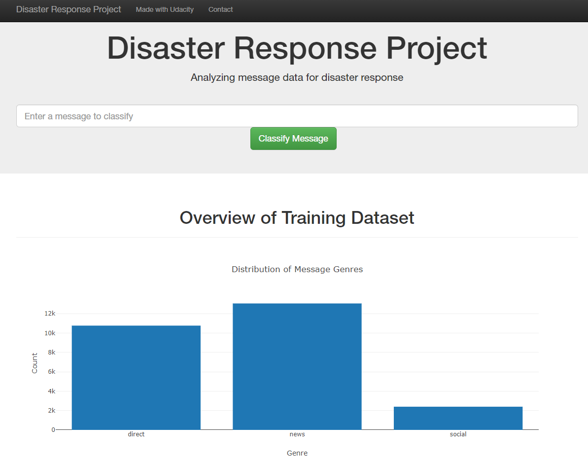

# Disaster Response Pipeline Project

### Descriptions:

The current project is an assignment of the Udacity nanodegree program. The aim is to analyze disaster messages from Figure Eight and build a model that classifies these messages. The model building preparation files are saved in the "temp" folder.
The project was divided in three steps:
- Build a ETL pipeline to extract, clean and save data as a SQLite database
- Build a machine learning pipeline to extract features from the messages using natural language processing algorithms
- Run a web app with flask


### File Description
```
.
├── app     
│   ├── run.py                           # Flask file that runs app
│   └── templates   
│       ├── go.html                      # Classification result page of web app
│       └── master.html                  # Main page of web app    
├── data                   
│   ├── disaster_categories.csv          # Dataset including all the categories  
│   ├── disaster_messages.csv            # Dataset including all the messages
│   └── process_data.py                  # Data cleaning
├── models
│   └── train_classifier.py              # Train ML model           
└── README.md
```

### Dependencies 
- Machine Learning Libraries: NumPy, SciPy, Pandas, Sciki-Learn
- Natural Language Process Libraries: NLTK
- SQLlite Database Libraqries: SQLalchemy
- Model Loading and Saving Library: Pickle
- Web App and Data Visualization: Flask, Plotly


### Instructions:
1. Run the following commands in the project's root directory to set up your database and model.

    - To run ETL pipeline that cleans data and stores in database
        `python data/process_data.py data/disaster_messages.csv data/disaster_categories.csv data/DisasterResponse.db`
    - To run ML pipeline that trains classifier and saves
        `python models/train_classifier.py data/DisasterResponse.db models/classifier.pkl`

2. Run the following command in the app's directory to run your web app.
    `python run.py`

3. Go to http://0.0.0.0:3001/


